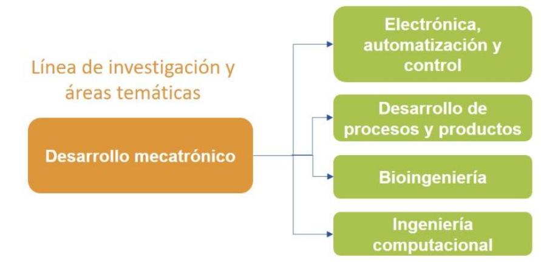

# Repositorio del Programa de Ingeniería Mecatrónica

Este repositorio **almacena los formatos de trabajo de grado** para el programa de Ingeniería Mecatrónica, abarcando las categorías de *Idea*, *Anteproyecto*, y *Proyecto Final*.

## 📝 Idea

Aquí se encuentran los formatos y guías para la **presentación de ideas** de proyectos de grado.

## 📄 Anteproyecto

En esta sección se almacenan los formatos requeridos para la **elaboración y presentación de anteproyectos**.

## 🏆 Final

Esta parte del repositorio contiene los formatos finales para la **presentación de proyectos de grado completados**.
## Linea de investigación y áreas temáticas del programa: 

## 📢 Solicitudes a CIPRO

Para cualquier solicitud relacionada con los procesos de trabajo de grado, por favor dirigirse a [**CIPRO - Haga clic aquí para más información**](https://forms.gle/gT6W2tXAkv47Y1SP6).

